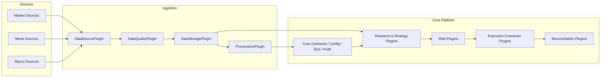

# Architecture

## System Diagram

## Verbal Description
- **Source/Ingestion layer** is externalized: MarketData is the single authoritative data platform.
- **AlgoTradePlan data module** is now a thin shim (`DataHub`/`ETL`) that delegates to MarketData bridge (`MARKET_DATA_BIN`).
- **Core platform** supplies ids, config loading, event distribution, and audit scaffolding shared by all later phases.
- **Decision layer** houses strategy, risk, execution, and reconciliation plugins behind stable interfaces.
- **Governance layer** is represented by phase docs, runbooks, extension guidance, and approval checklists.

## Module Boundaries
- `src/algotradeplan/core`: core ids, contracts, schema helpers, clock
- `src/algotradeplan/config`: runtime config loading and environment parsing
- `src/algotradeplan/bus`: local event routing scaffold
- `src/algotradeplan/audit`: deterministic event storage scaffold
- `src/algotradeplan/data`: thin MarketData compatibility wrappers only
- `src/algotradeplan/plugins`: plugin interfaces for agents and execution domains
- `src/algotradeplan/plugins/data`: shared data DTO contracts
- `tests`: unit, adapter, and smoke verification

## Architectural Rules
- phase documents are authoritative for sequencing
- domain plugins must depend on contracts, not on concrete downstream implementations
- provenance and quality remain required, but are enforced by MarketData
