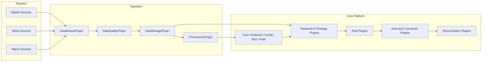

# Architecture

## System Diagram

## Verbal Description
- **Source layer** collects market, news, and macro inputs through pluggable adapters.
- **Ingestion layer** normalizes records, applies quality checks, persists accepted batches, and emits provenance metadata.
- **Core platform** supplies ids, config loading, event distribution, and audit scaffolding shared by all later phases.
- **Decision layer** houses strategy, risk, execution, and reconciliation plugins behind stable interfaces.
- **Governance layer** is represented by phase docs, runbooks, extension guidance, and approval checklists.

## Module Boundaries
- `src/algotradeplan/core`: core ids, contracts, schema helpers, clock
- `src/algotradeplan/config`: runtime config loading and environment parsing
- `src/algotradeplan/bus`: local event routing scaffold
- `src/algotradeplan/audit`: deterministic event storage scaffold
- `src/algotradeplan/data_ingestion`: tabular bootstrap helpers
- `src/algotradeplan/plugins`: plugin interfaces for agents and execution domains
- `src/algotradeplan/plugins/data`: multi-domain ingestion/storage/quality/provenance contracts and examples
- `tests`: unit, adapter, and smoke verification

## Architectural Rules
- phase documents are authoritative for sequencing
- domain plugins must depend on contracts, not on concrete downstream implementations
- provenance and quality are required steps in the ingestion flow
- example plugins and tests are part of each extension root
